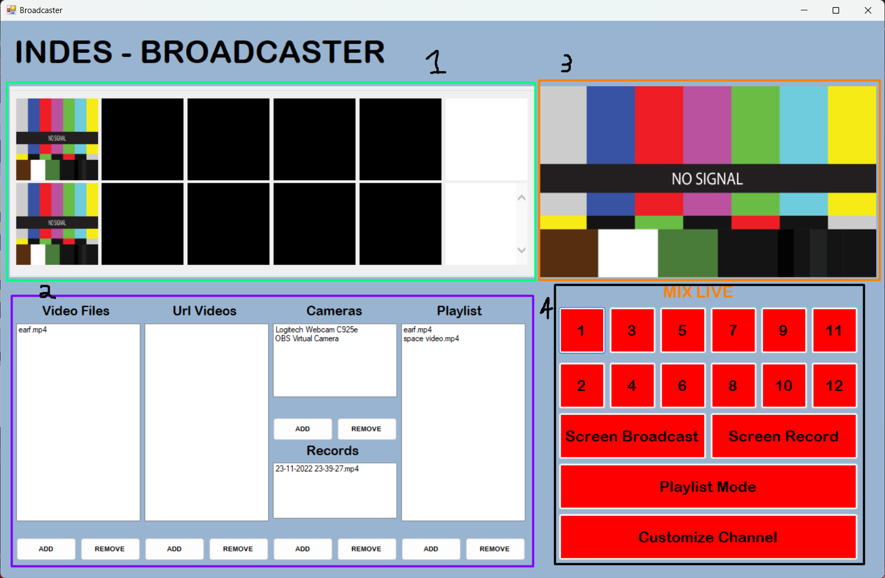
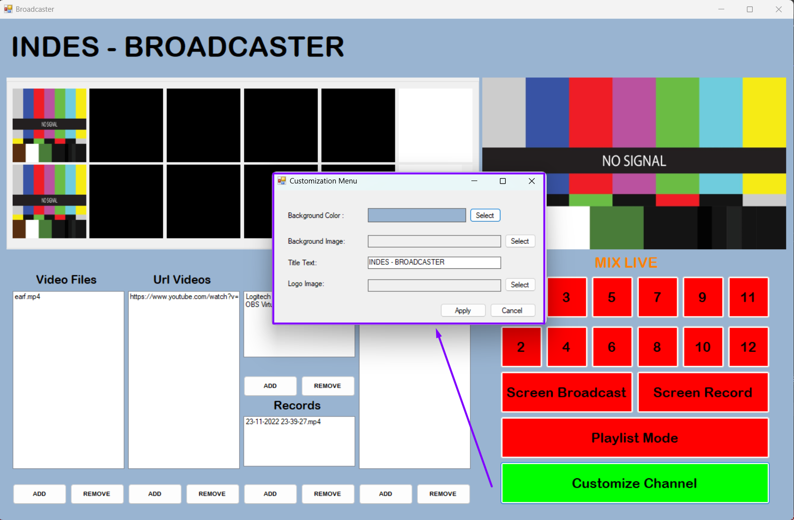

# INDES-Broadcaster

## Controls

In the image below is the main form of the Broadcaster application.

As we can see this form is divided in four sections:

1. **Preview Area** - In this area the user can preview the video feed of his local and IP cameras, local videos and external URL videos before transmitting them to the live broadcast area. This area contains 10 boxes, the first 2 (no signal boxes) for local cameras and IP cameras preview, 8 black boxes for local video files preview and finally 2 white boxes for external URL videos.
2. **Files and Cameras Selection Area** - Here the user can add, see and remove all the different files and cameras he wants. One thing to consider is that all lists except the 'Playlist' one have drag and drop functionalities for better interactivity. So for example, if the user wants to preview his local camera feed he only needs to drag the name of his camera in the 'Cameras' list to the preview box number 1 or 2.
3. **Broadcast Area** - This area contains one box responsible for simulating the live broadcast of one of the previews, depending on which one the user chooses, the computer screen or even the videos in the 'Playlist' list.
4. **Mix Live Area** - In here, the user can select which preview he wants to broadcast, by clicking in one of the 12 number buttons. Below these buttons, we have one button to broadcast the user computer screen, 'Screen Broadcast', and another button, 'Screen Record', to record a video of the user computer screen that will be added to the 'Records' list. Additionally, the user can choose to play the list of videos located in the 'Playlist' list, by clicking the 'Playlist Mode'. Regarding the 'Customize Channel' button, when clicked, another form will appear, as we can see in the image below. In this form, the user will be able to customize the main form as he wants, like changing the background color or image, the form title and last but not least, adding a small icon in the top right corner of the screen, above the 'Broadcast Area'. 

One important thing to note is that when we click on any button to live broadcast (the number buttons or the 'Screen Broadcast' and the 'Playlist Mode' buttons), its color will turn green, meaning that is activated. Additionally, the other buttons will be deactivated, that is, its color will be red.